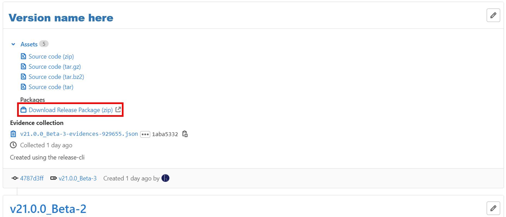
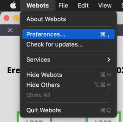
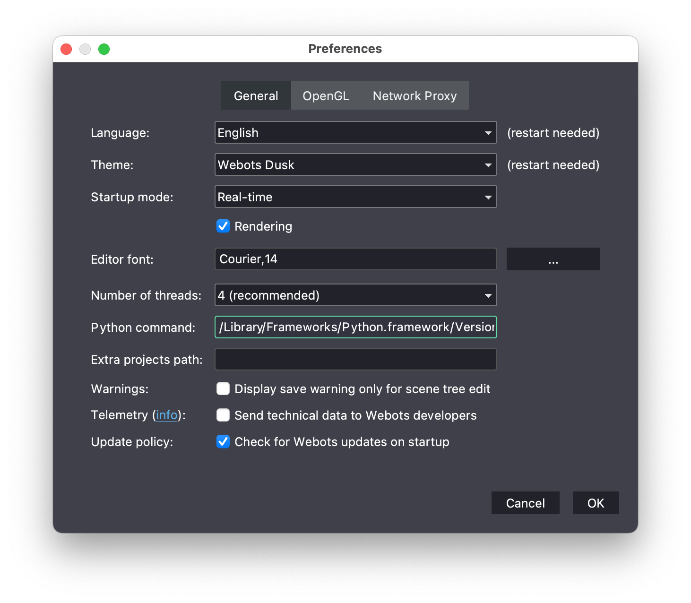
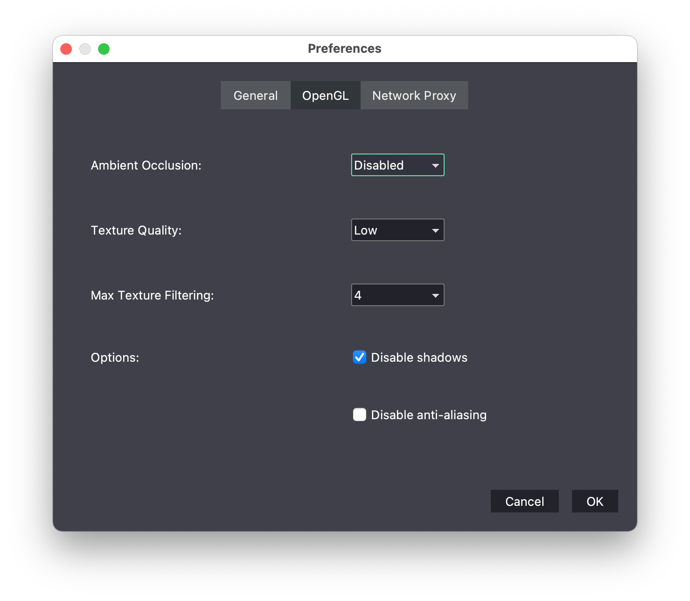

## Installation & Setup Guide
1. Download & Install Python **3.10.x** 64 bit from the [official website](https://www.python.org/downloads/macos/).  **Even if you have Python installed on your system via brew, anaconda, etc., we recommend that you install it afresh. Otherwise, the simulation may not work properly.** 

1. Download & Install the Webots version **2023.b** from their [official repository](https://github.com/cyberbotics/webots/releases/download/R2023b/webots-R2023b.dmg).   

1. Download and **unzip** the latest Erebus [Release Build](https://github.com/robocup-junior/erebus/releases).

## Run the environment
Double click to run the world.wbt file from `/game/worlds/world1.wbt`, opening it in Webots.
The first time you run the simulator, it will automatically install the Python libraries needed to run the simulation, which may take some time (Initializing Process).

If the time limit is not displayed, as in the following image, the initializing process is in progress. This process can take up to a minutes, depending on the performance of your computer.  

## Troubleshooting
First of all, please check the console window. If you see any errors, you will need to try to resolve them.

### Common Errors
#### `WARNING: Python was not found`
1. Open the terminal and excute following command  
`which python`
2. Open Webots -> Preferences.  

1. Set the path found in step1 to "Python command" field.  

### The simulation runs too slowly
This is probably due to the low performance of your computer. This may be improved by adjusting the "accuracy" of the graphics according to the following procedure. However, you should take into account that these "adjustments" are only valid for testing in your environment, and that in a competition the game may be run under different adjustments.
1. Open Webots -> Preferences.
2. Open the OpenGL tab
3. Set the various parameters appropriately.
