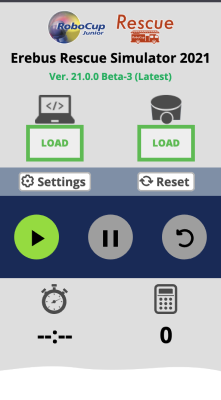

## Quick Installation Guide
1. Download & Install Python **3.9.x** or **3.10.x** 64 bit from the [official website](https://www.python.org/downloads/windows/). During the install option, please make your python installation is referenced in your PATH (see picture below!)

1. Download & Install the Webots version **2023.b** from their [official repository](https://github.com/cyberbotics/webots/releases/download/R2023b/webots-R2023b_setup.exe).

1. Download and **unzip** the latest Erebus [Release Build](https://github.com/robocup-junior/erebus/releases).

## Run the environment
Double click to run the world.wbt file from `/game/worlds/world1.wbt`, opening it in Webots.
The first time you run the simulator, it will automatically install the Python libraries needed to run the simulation, which may take some time (Initializing Process).

If the time limit is not displayed, as in the following image, the initializing process is in progress. This process can take up to a minutes, depending on the performance of your computer.  

## Troubleshooting
### The initializing process is not finished forever
1. First of all, please check the console window. If you see any errors, you will need to try to resolve them.
2. If you don't see any errors, the automatic installation of the required libraries may not be working properly; start Powershell and run the following command.
  `python3 -m pip install numpy termcolor requests`

### If your Webots screen comes up blank/black
Copy and the download, unzip to a separate folder before opening the world. It should then work.

### Can't load a controller
This most likely means that Python has not been added to the Path correctly. To address this:

1. Check to see if Python is in your path. Goto Command Prompt --> type PATH. Your will get some file locations returned. Is Python in this? If not add it using this method: https://datatofish.com/add-python-to-windows-path/
1/ To check this has worked, open a new command prompt windows and type 'python' - python should now open
1. Now tell Webots where python is. Open Webots --> tools--> preferences --> python command. enter 'python' of the same word used in your path.
Paths are messy and frustrating, and it can take a bit of work to iron out all the issues!

### The simulation runs too slowly
This is probably due to the low performance of your computer. This may be improved by adjusting the "accuracy" of the graphics according to the following procedure. However, you should take into account that these "adjustments" are only valid for testing in your environment, and that in a competition the game may be run under different adjustments.
1. Open Tools -> Preferences in the top navigation bar.
2. Open the OpenGL tab
3. Set the various parameters appropriately.

### Competition Controller does not appear
After some minutes, if the time limit is not displayed, as in the following image, please check the following [help](/docs/tutorials/getting-started/#competition-controller-does-not-appear).

