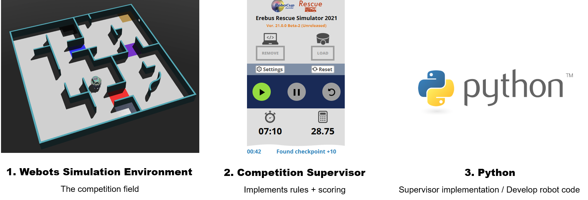

## Software Requirements
There are key components which make up the simulation system. These must each be installed. Although installation is easy, the download and install of webots can take a little bit of time! The three components are:

1. Webots Robot Simulator Version **2021.a** - the simulation environment
1. Competition Supervisor - Implement the rules and scoring
1. Python Version **3.x** - to write controllers for the robots

## Minimum System Requirements
* OS-Linux: Ubuntu 18.04 LTS, 20.04 LTS 64bit
* OS-Windows: Win 10, 8.1 64 bit
* OS-Mac: macOS 10.14 'Mojave' or newer
* CPU: Dual Core 2 GHz
* RAM: 2 GB
* Nvidia 512MB or AMD OpenGL 512MB

## Installation Guide
