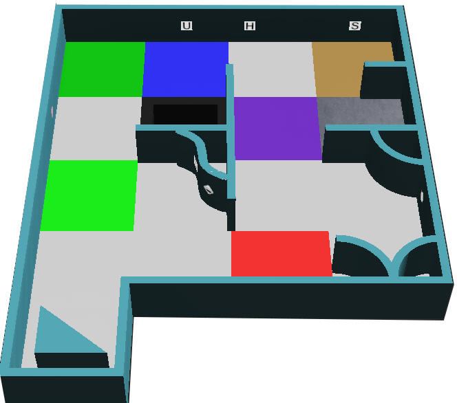
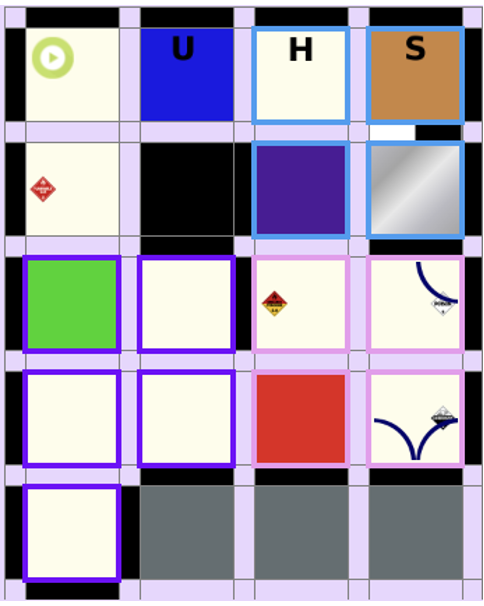

## General Idea
Mapping is scored as a multiplier to the overall scores obtained during the run. To obtain a mapping multiplier, the robot must submit a matrix to the game’s main supervisor at the end of the game. Here, the submitted matrix is compared against the “answer key” to produce a correctness score.

## Rules for Mapping
* Each quarter tile and its surrounding edges and vertices will be represented by a cell (value).
* Each element in the world is represented by the following:

<table style="text-align:center">
    <tbody>
        <tr>
        <td>Walls</td>
        <td>1</td>
        </tr>
        <tr>
        <td>Holes</td>
        <td>2</td>
        </tr>
        <tr>
        <td>Swamps</td>
        <td>3</td>
        </tr>
        <tr>
        <td>Checkpoints</td>
        <td>4</td>
        </tr>
        <tr>
        <td>Starting tile</td>
        <td>5</td>
        </tr>
        <tr>
        <td>Connection tiles from area 1 to 2</td>
        <td>b</td>
        </tr>
        <tr>
        <td>Connection tiles from area 2 to 3</td>
        <td>p</td>
        </tr>
        <tr>
        <td>Connection tiles from area 3 to 4</td>
        <td>r</td>
        </tr>
        <tr>
        <td>Connection tiles from area 1 to 4</td>
        <td>g</td>
        </tr>
        <tr>
        <td>Connection tiles from area 1 to 3</td>
        <td>o</td>
        </tr>
        <tr>
        <td>Connection tiles from area 2 to 4</td>
        <td>y</td>
        </tr>
        <tr>
        <td>Victims</td>
        <td>The corresponding victim code (H,S,U,F,P,C,O)</td>
        </tr>
        <tr>
        <td>All area 4 tiles/edges/vertices</td>
        <td>Any character (*)</td>
        </tr>
        <tr>
        <td>Any other tiles/edges/vertices</td>
        <td>0</td>
        </tr>
    </tbody>
</table>

* For curved walls in area 3, the vertex should be represented by a '0'.
* The presence of a victim should be marked on the cell that represents the corresponding wall. If more than one victim is on a wall, the entry should be concatenated. 
* Victims in full tiles (non-quarter tiles) will be skewed horizontally/vertically. They should be placed in whichever quarter tile 
they are skewed closer to.
* Maps can be stored in any rotation as long as it is a multiple of 90°


## Ambiguous edge cases
For ambiguous edge cases that were are not defined below, please contact the TC and/or the platform development team. 
### One wall with a normal right-angled wall and a curved wall on each side
The rules say that the vertices of a curved wall should be represented by zeroes.
The exception is the following case, where one side of the wall is a normal right angle and the other side is curved, which is represented in the same way as if both sides were normal walls.



## Examples
These are examples of correct answers for some of the maps. The world files used here are provided to you as sample worlds.

### world1.wbt


```
[
['1', '1', '1', '1', '1', '1', '1', '1', '1', '1', '1', '1', '1', '1', '1', '1', '1', '1', '1', '1', '1', '1', '1', '1', '1', '1', '1', '1', '1', '1', '1', '1', '1'], 
['1', '5', '0', '5', '0', '0', '0', '0', '0', '0', '0', '0', '0', '2', '0', '2', '1', '0', '0', '0', '1', '0', '0', '0', '0', '0', '0', '0', '0', '3', '0', '3', '1'], 
['1', '0', '0', '0', '0', '0', '0', '0', '0', '0', '0', '0', '0', '0', '0', '0', '1', '0', '0', '0', '1', '0', '0', '0', '0', '0', '0', '0', '0', '0', '0', '0', '1'], 
['1', '5', '0', '5', '0', '0', '0', '0', '0', '0', '0', '0', '0', '2', '0', '2', '1', '0', '0', '0', '0', '0', '0', '0', '0', '0', '0', '0', '0', '3', '0', '3', '1'], 
['1', '0', '0', '0', '0', '0', '0', '0', '1', '0', '0', '0', '0', '0', '0', '0', '1', '0', '0', '0', '0', '0', '0', '0', '0', '0', '0', '0', '0', '0', '0', '0', '1'], 
['1', '0', '0', '0', '0', '0', '0', '0', '1', '0', '0', '0', '0', '0', '0', '0', '1', '0', '0', '0', '0', '0', '0', '0', '0', '0', '0', '0', '0', '0', '0', '0', 'S'], 
['1', '0', '0', '0', '0', '0', '0', '0', '1', '0', '0', '0', '0', '0', '0', '0', '1', '0', '0', '0', '0', '0', '0', '0', '1', '0', '0', '0', '0', '0', '0', '0', '1'], 
['1', '0', '0', '0', '0', '0', '0', '0', '1', '0', '0', '0', '0', '0', '0', '0', '1', '0', '0', '0', '0', '0', '0', '0', '1', '0', '0', '0', '0', '0', '0', '0', '1'], 
['1', '0', '0', '0', '1', '1', '1', '1', '1', '0', '0', '0', '1', '1', '1', '1', '1', '0', '0', '0', '0', '0', '0', '0', '1', '1', '1', '0', '0', '0', '0', '0', '1'], 
['F', '0', '0', '0', '0', '0', '0', '0', '1', '0', '0', '0', '0', 'b', '0', 'b', '0', '0', '0', '0', '0', '0', '0', '0', '1', '0', '0', '0', '0', '0', '0', '0', '1'], 
['1', '0', '0', '0', '0', '0', '0', '0', '1', '0', '0', '0', '0', '0', '0', '0', '0', '0', '0', '0', '0', '0', '0', '0', '1', '0', '0', '0', '0', '0', '0', '0', '1'], 
['1', '0', '0', '0', '0', '0', '0', '0', '1', '0', '0', '0', '0', 'b', '0', 'b', '0', '0', '0', '0', '0', '0', '0', '0', '0', '0', '0', '0', '0', '0', '0', '0', '1'], 
['1', '0', '0', '0', '0', '0', '0', '0', '1', '0', '0', '0', '1', '1', '1', '1', '1', '1', '1', '0', '0', '0', '0', '0', '1', '0', '0', '0', '1', '0', '0', '0', '1'], 
['1', '0', '0', '0', '0', '0', '0', '0', '1', '0', '0', '0', '0', '0', '0', '0', '1', '0', '0', '0', '0', '0', '0', '0', '1', 'p', '0', 'p', '1', '0', '0', '0', '1'], 
['1', '0', '0', '0', '0', '0', '0', '0', '1', '0', '0', '0', '0', '0', '0', '0', '1', '0', '0', '0', '0', '0', '0', '0', '1', '0', '0', '0', '1', '0', '0', '0', '1'], 
['1', '0', '0', '0', '0', '0', '0', '0', '1', '0', '0', '0', '0', '0', '0', '0', '1', '0', '0', '0', '0', '0', '0', '0', '1', 'p', '0', 'p', '1', '0', '0', '0', '1'], 
['1', '0', '0', '0', '0', '0', '0', '0', '1', '0', '0', '0', '0', '0', '0', '0', '1', '1', '1', '1', '1', '1', '1', '1', '1', '0', '0', '0', '1', '1', '1', '1', '1'], 
['1', '0', '0', '0', '0', '0', '0', '0', '0', '0', '0', '0', '0', '0', '0', '0', '0', '0', '0', '0', '1', '0', '0', '0', '0', '0', '0', '0', '0', '0', '0', '0', '1'], 
['1', '0', '0', '0', '0', '0', '0', '0', '0', '0', '0', '0', '0', '0', '0', '0', '0', '0', '0', '0', '1', '0', '0', '0', '0', '0', '0', '0', '0', '0', '0', '0', '1'], 
['1', '0', '0', '0', '0', '0', '0', '0', '0', '0', '0', '0', '0', '0', '0', '0', '0', '0', '0', '0', '1', '0', '0', '0', '0', '0', '0', '0', '0', '0', '0', '0', '1'], 
['1', '0', '0', '0', '0', '0', '0', '0', '1', '0', '0', '0', '1', '0', '0', '0', '0', '0', '0', '0', '1', '0', '0', '0', '0', '0', '1', '0', '0', '0', '0', '0', '1'], 
['1', '0', '0', '0', '0', '0', '0', '0', '1', '0', '0', '0', '1', '0', '0', '0', '0', '0', '0', '0', '1', '0', '0', '0', '0', '0', '1', '0', '0', '0', '0', '0', '1'], 
['1', '0', '0', '0', '0', '0', '0', '0', '1', '0', '0', '0', '1', '0', '0', '0', '0', '0', '0', '0', '1', '0', '0', '0', '0', '0', '1', '1', '1', '0', '0', '0', '1'], 
['1', '0', '0', '0', '0', '0', '0', '0', '1', '0', '0', '0', '1', '0', '0', '0', '0', '0', '0', '0', 'U', '0', '0', '0', '0', '0', '0', '0', '0', '0', '0', '0', '1'], 
['1', '0', '0', '0', '0', '0', '0', '0', '1', '1', '1', 'H', '1', '0', '0', '0', '0', '0', '0', '0', '1', '0', '0', '0', '0', '0', '0', '0', '1', '0', '0', '0', '1'], 
['1', '0', '0', '0', '0', '0', '0', '0', '0', '0', '0', '0', '1', '0', '0', '0', '0', '0', '0', '0', '1', '0', '0', '0', '0', '0', '0', '0', '1', '0', '0', '0', '1'], 
['1', '0', '0', '0', '0', '0', '0', '0', '0', '0', '0', '0', '1', '0', '0', '0', '0', '0', '0', '0', '1', '0', '0', '0', '0', '1', '1', '1', '0', '0', '0', '0', '1'], 
['P', '0', '0', '0', '0', '0', '0', '0', '0', '0', '0', '0', '1', '0', '0', '0', '0', '0', '0', '0', '1', '0', '0', '0', '1', '0', '0', '0', '0', '0', '0', '0', '1'], 
['1', '0', '0', '0', '0', '0', '0', '0', '0', '0', '0', '0', '1', '0', '0', '0', '0', '0', '0', '0', '1', '0', '0', '0', '1', '0', '0', '0', '0', '0', '0', '0', '1'], 
['1', '0', '0', '0', '0', '0', '0', '0', '0', '0', '0', '0', '0', '0', '0', '0', '0', '4', '0', '4', '1', '0', '0', '0', '0', '0', '0', '0', '0', '0', '0', '0', '1'], 
['1', '0', '0', '0', '0', '0', '0', '0', '0', '0', '0', '0', '0', '0', '0', '0', '0', '0', '0', '0', '1', '0', '0', '0', '0', '0', '0', '0', '0', '0', '0', '0', '1'], 
['1', '0', '0', '0', '0', '0', '0', '0', '0', '0', '0', '0', '0', '0', '0', '0', '0', '4', '0', '4', '1', '0', '0', '0', '0', '0', '0', '0', '0', '0', '0', '0', '1'], 
['1', '1', '1', '1', '1', '1', '1', '1', '1', '1', '1', '1', '1', '1', '1', '1', '1', '1', '1', '1', '1', '1', '1', '1', '1', '1', '1', '1', '1', '1', '1', '1', '1']
]
```

### world2.wbt


```
[
['1', '1', '1', '1', '1', '1', '1', '1', '1', '1', '1', '1', '1', '1', '1', '1', '1', '1', '1', '1', '1', 'P', '1', '1', '1', '1', '1', '1', '1', '1', '1', '1', '1', '1', '1', '1', '1'], 
['1', '4', '0', '4', '0', '0', '0', '0', '0', '0', '0', '0', '1', '0', '0', '0', '0', '2', '0', '2', '1', '0', '0', '0', '0', '0', '0', '0', '0', '3', '0', '3', '1', '2', '0', '2', '1'], 
['1', '0', '0', '0', '0', '0', '0', '0', '1', '0', '0', '0', '1', '0', '0', '0', '0', '0', '0', '0', '1', '0', '0', '0', '0', '0', '0', '0', '0', '0', '0', '0', '1', '0', '0', '0', '1'], 
['1', '4', '0', '4', '0', '0', '0', '0', 'C', '0', '0', '0', '0', '0', '0', '0', '0', '2', '0', '2', '1', '0', '0', '0', '0', '0', '0', '0', '0', '3', '0', '3', '1', '2', '0', '2', '1'], 
['1', '1', '1', '1', '1', '0', '0', '0', '1', '0', '0', '0', '0', '0', '0', '0', '1', '1', '1', '1', '1', '0', '0', '0', '1', '1', '1', '1', '1', '0', '0', '0', '1', '0', '0', '0', '1'], 
['1', '0', '1', '0', '0', '0', '0', '0', '0', '0', '0', '0', '0', '0', '0', '0', '1', 'b', '0', 'b', '0', '0', '0', '0', '0', '0', '0', '0', 'O', '0', '0', '0', '0', '0', '0', '0', '1'], 
['1', 'U', '1', '0', '0', '0', '0', '0', '0', '0', '0', '0', '0', '0', '1', '1', '1', '0', '0', '0', '0', '0', '0', '0', '0', '0', '0', '0', '1', '0', '0', '0', '0', '0', '0', '0', '1'], 
['1', '0', '0', '0', '0', '0', '0', '0', '0', '0', '0', '0', '0', '0', '0', '0', '1', 'b', '0', 'b', '0', '0', '0', '0', '0', '0', '0', '0', '1', '0', '0', '0', '0', '0', '0', '0', '1'], 
['1', '0', '0', '0', '0', '0', '0', '0', '1', '0', '0', '0', '0', '0', '0', '0', '1', '0', '0', '0', '1', '1', '1', '1', '1', '1', '1', '1', '1', '0', '0', '0', '1', '0', '0', '0', '1'], 
['1', '0', '0', '0', '0', '0', '0', '0', '1', 'p', '0', 'p', '0', '0', '0', '0', '0', '0', '0', '0', '0', '4', '0', '4', 'H', '0', '0', '0', '0', '0', '0', '0', '1', '5', '0', '5', '1'], 
['1', '0', '0', '0', '1', '0', '0', '0', '1', '0', '0', '0', '1', '0', '0', '0', '0', '0', '0', '0', '0', '0', '0', '0', '1', '0', '0', '0', '0', '0', '0', '0', '1', '0', '0', '0', '1'], 
['1', '0', '0', '0', '1', '0', '0', '0', '1', 'p', '0', 'p', '1', '0', '0', '0', '0', '0', '0', '0', '0', '4', '0', '4', '1', '0', '0', '0', '0', '0', '0', '0', '1', '5', '0', '5', '1'], 
['1', '1', '1', 'S', '1', '1', '1', '1', '1', '0', '0', '0', '1', '1', '1', '1', '*', '*', '*', '*', '*', '*', '*', '*', '*', '*', '*', '*', '*', '0', '0', '0', '1', '0', '0', '0', '1'], 
['1', '0', '0', '0', '0', '0', '0', '0', '1', '0', '0', '0', '1', '0', '0', '0', '*', '*', '*', '*', '*', '*', '*', '*', '*', '*', '*', '*', '*', 'g', '0', 'g', '0', '0', '0', '0', '1'], 
['1', '0', '0', '0', '0', '1', '1', '1', '0', '0', '0', '0', '1', '0', '0', '0', '*', '*', '*', '*', '*', '*', '*', '*', '*', '*', '*', '*', '*', '0', '0', '0', '0', '0', '0', '0', '1'], 
['1', '0', '0', '0', '1', '0', '0', '0', '0', '0', '0', '0', '1', '0', '0', '0', '*', '*', '*', '*', '*', '*', '*', '*', '*', '*', '*', '*', '*', 'g', '0', 'g', '0', '0', '0', '0', '1'], 
['1', '0', '0', '0', '1', '0', '0', '0', '0', '0', '1', '1', '1', '0', '0', '0', '*', '*', '*', '*', '*', '*', '*', '*', '*', '*', '*', '*', '*', '*', '*', '*', '*', '*', '*', '*', '*'], 
['1', '4', '0', '4', '0', '0', '0', '0', '0', '0', '0', '0', '0', '3', '0', '3', '0', '0', '0', '0', '*', '*', '*', '*', '*', '*', '*', '*', '*', '*', '*', '*', '*', '*', '*', '*', '*'], 
['1', '0', '0', '0', '0', '0', '0', '0', '0', '0', '0', '0', '0', '0', '0', '0', '0', '0', '0', '0', '*', '*', '*', '*', '*', '*', '*', '*', '*', '*', '*', '*', '*', '*', '*', '*', '*'], 
['1', '4', '0', '4', '0', '0', '0', '0', '0', '0', '0', '0', '0', '3', '0', '3', '0', '0', '0', '0', '*', '*', '*', '*', '*', '*', '*', '*', '*', '*', '*', '*', '*', '*', '*', '*', '*'], 
['1', '0', '0', '0', '0', '0', '0', '0', '0', '0', '0', '0', '1', '0', '0', '0', '0', '0', '0', '0', '*', '*', '*', '*', '*', '*', '*', '*', '*', '*', '*', '*', '*', '*', '*', '*', '*'], 
['1', '0', '0', '0', '0', '0', '0', '0', '0', '2', '0', '2', '1', '0', '0', '0', '0', 'r', '0', 'r', '*', '*', '*', '*', '*', '*', '*', '*', '*', '*', '*', '*', '*', '*', '*', '*', '*'], 
['1', '0', '0', '0', '0', '0', '1', '0', '0', '0', '0', '0', '1', '0', '0', '0', '0', '0', '0', '0', '*', '*', '*', '*', '*', '*', '*', '*', '*', '*', '*', '*', '*', '*', '*', '*', '*'], 
['1', '0', '0', '0', '0', '0', '1', '0', '0', '2', '0', '2', '1', '0', '0', '0', '0', 'r', '0', 'r', '*', '*', '*', '*', '*', '*', '*', '*', '*', '*', '*', '*', '*', '*', '*', '*', '*'], 
['1', '1', '1', '1', '1', '1', '1', '1', '1', '1', '1', '1', '1', '1', '1', '1', '1', '1', '1', '1', '*', '*', '*', '*', '*', '*', '*', '*', '*', '*', '*', '*', '*', '*', '*', '*', '*']
]
```

### room4_small.wbt


Webots environment             |  Corresponding world editor setup
:-------------------------:|:-------------------------:
  |  




<!---
### world2.wbt


```
[
        ['1', '1', '1', '1', '1', '1', '1', '1', '1', '1', '1', '1', '1', '1', '1', '1', '1', '1', '1', '1', '1', '1', '1', '1', '1', '1', '1', '1', '0'],
        ['1', '0', '0', '0', '0', '0', '0', '0', '1', '0', '0', '0', '0', '5', '0', '5', '0', '0', '0', '0', '1', '4', '0', '4', '0', '0', '0', '0', '1'],
        ['1', '0', '0', '0', '0', '0', '0', '0', '1', '0', '0', '0', '0', '0', '0', '0', '0', '0', '0', '0', '1', '0', '0', '0', '0', '0', '0', '0', '1'],
        ['1', '0', '0', '0', '0', '0', '0', '0', 'FH', '0', '0', '0', '0', '5', '0', '5', '0', '0', '0', '0', '1', '4', '0', '4', '0', '0', '0', '0', 'F'],
        ['1', '1', '1', '0', '0', '0', '1', '1', '1', '1', '1', '1', '1', '1', '1', '1', '1', '0', '0', '0', '1', '1', '0', '0', '0', '0', '0', '0', '1'],
        ['1', '0', '0', '0', '0', '4', '0', '4', '1', '2', '0', '2', '0', '3', '0', '3', '0', '0', '0', '0', '1', '0', '1', '0', '0', '3', '0', '3', '1'],
        ['1', '0', '0', '0', '0', '0', '0', '0', '1', '0', '0', '0', '0', '0', '0', '0', '0', '0', '0', '0', '1', '0', '1', '0', '0', '0', '0', '0', '1'],
        ['1', '0', '0', '0', '0', '4', '0', '4', '1', '2', '0', '2', '0', '3', '0', '3', '0', '0', '0', '0', '1', '0', '1', '0', '0', '3', '0', '3', '1'],
        ['1', '1', '1', '1', '1', '0', '0', '0', '1', 'U', '1', '1', '1', '0', '0', '0', '1', 'SO', '1', '1', '1', '1', '0', '0', '0', '0', '0', '1', '1'],
        ['1', '0', '0', '0', '0', '0', '0', '0', '1', '0', '0', '0', '0', '4', '0', '4', '1', '0', '0', '0', '0', '0', '0', '0', '0', '0', '1', '0', '0'],
        ['1', '0', '0', '0', '0', '0', '0', '0', '1', '0', '0', '0', '0', '0', '0', '0', '1', '0', '0', '0', '0', '0', '0', '0', '0', '0', '1', '0', '0'],
        ['1', '0', '0', '0', '0', '0', '0', '0', '1', '0', '0', '0', '0', '4', '0', '4', '1', '0', '0', '0', '0', '0', '0', '0', '0', '0', '1', '0', '0'],
        ['1', '1', '1', '0', '0', '0', '1', '1', '1', '0', '0', '0', '1', '0', '0', '0', '1', '1', '1', '1', '1', '1', '1', '0', '0', '0', '0', '1', '1'],
        ['0', '0', 'S', '0', '0', '0', '0', '0', '1', 'b', '0', 'b', '1', 'p', '0', 'p', '0', '0', '0', '0', '0', '0', '0', '0', '0', '0', '0', '0', 'U'],
        ['1', '1', '1', '0', '0', '0', '0', '0', '1', '0', '0', '0', '1', '0', '0', '0', '0', '0', '0', '0', '0', '0', '0', '0', '0', '0', '0', '0', '1'],
        ['1', '0', '0', '0', '0', '0', '0', '0', '1', 'b', '0', 'b', '1', 'p', '0', 'p', '0', '0', '0', '0', '0', '0', '0', '0', '0', '0', '0', '0', '1'],
        ['1', '0', '0', '0', '0', '0', '0', '0', '1', '0', '0', '0', '1', '1', '1', '1', '1', '1', '1', '1', '1', '0', '0', '0', '0', '0', '0', '0', '1'],
        ['1', '0', '0', '0', '0', '0', '0', '0', '0', '0', '0', '0', '0', '0', '0', '0', '0', '2', '0', '2', '1', '0', '0', '0', '0', '0', '0', '0', '1'],
        ['1', '1', '1', '0', '0', '0', '0', '0', '0', '0', '0', '0', '0', '0', '0', '0', '0', '0', '0', '0', '1', '0', '0', '0', '0', '0', '0', '0', '1'],
        ['0', '0', '1', '0', '0', '0', '0', '0', '0', '0', '0', '0', '0', '0', '0', '0', '0', '2', '0', '2', '1', '0', '0', '0', '0', '0', '0', '0', '1'],
        ['0', '0', '1', '1', '1', '1', '1', '1', '1', '1', '1', '1', '1', '1', '1', '1', '1', '1', '1', '1', '1', '1', '1', '1', '1', '1', '1', '1', '0']
    ]
```
-->