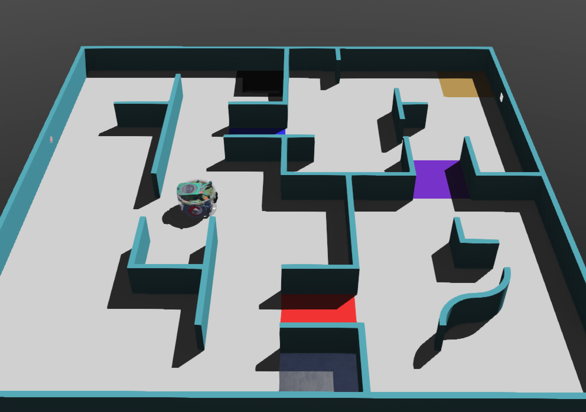
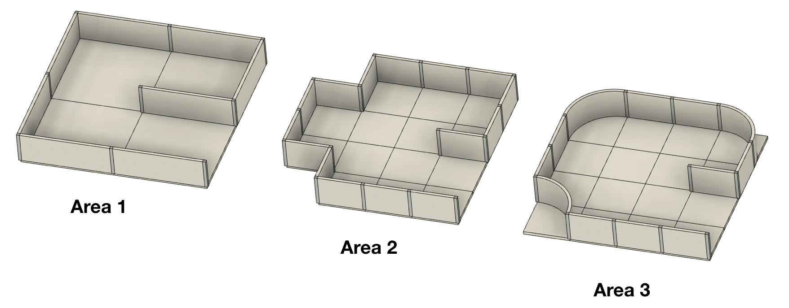
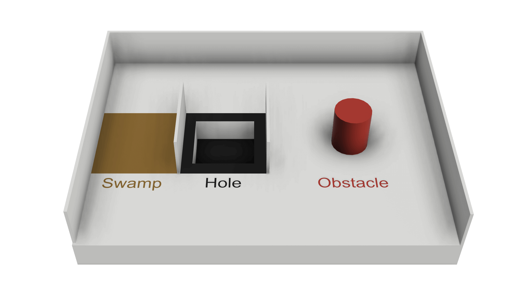

The official rules can be found on the [official RoboCupJunior homepage](https://junior.robocup.org/robocupjuniorrescue-league-new-simulation-demonstration/). 

Corrections and clarifications can be found on the [official RoboCupJunior Forum](https://junior.forum.robocup.org/)

We summarise some of the key rules below as a quick summary.

## Mission and objective
  
In the simulation challenge on the Erebus platform, there are three main missions. 
- Navigating around a complex maze environment
- Mapping the area accurately
- Detection and identification of victims

## The Maze Based Simulation Environment
The basic environemnt is comprised of tiles and walls. The smallest division used is the quarter-tile. 

  
- Area 1: walls are on the edge of each tile
- Area 2: walls can be placed on the edges of each quarter-tile with at least a full tile-width between two walls
- Area 3: walls can be placed on the edges of each quarter-tile with at least a full tile-width between two walls, 90° corners may be rounded into quarter circles

## Swamps, Traps & Obstacles
  

* Swamp (Brown area) - leads to speed being reduced slowing process
* Black holes – robot drops through, and is then relocated
* Obstacles – must be navigated around

## Victims and Hazmat Signs
Victims are comprised of letters H, S, and U.
* H: Harmed victim
* S: Stable victim
* U: Unharmed victim

Hazmat Signs are lebles given to hazardous materials and equipment (used in real life). The four labels shown above are used in the Erebus environment. 

* Flammable Gas (F)
* Poison (P)
* Corrosive (C)
* Organic Peroxide (O)

To identify a victim or hazard map, the robot must stop for 1 seconds, and send the location and victim type to the game manager The robot must be close (1/2 tile away) from the victim/hazard map.

## Lack of Progress
When a lack of progress(LoP) happens or is called, the robot will restart from the most recent visited check point tiles (marked by a silver colour). A LoP happens when,
- The robot has fallen into a hole.
- Robot being in a static location for 20 seconds or more (automatically called).
- The referee determines the robot is not completely static but is stuck in sequence of motion.
- There will be a button to execute a manual lack of progress (used by referees in the 2021 competition).
- The robot autonomously calls for a LoP.

## Mapping
Mapping is scored as a multiplier to the overall scores obtained during the run. To obtain a mapping multiplier, the robot must submit a matrix to the game's main supervisor at the end of the game. Here, the submitted matrix is compared against the "answer key" to produce a correctness score. 

For more detailed mapping instructions, see [here](/docs/rules/mapping/).

## Exit Bonus
If the robot is able to return to the start tile before the end of the game, an extra 10% increase is given to your score.
