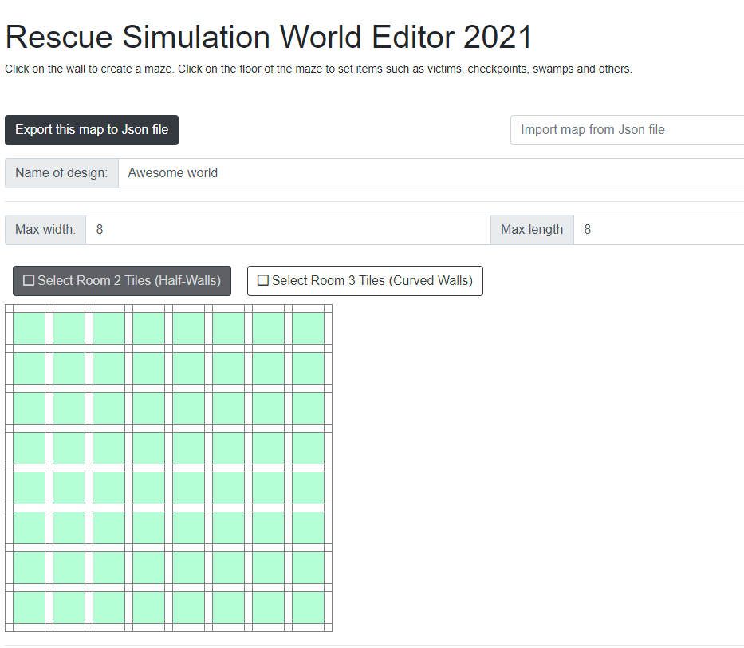
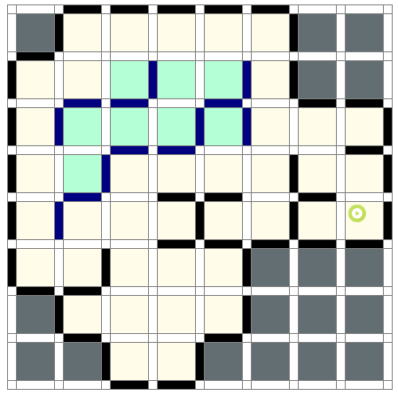
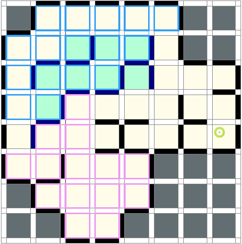
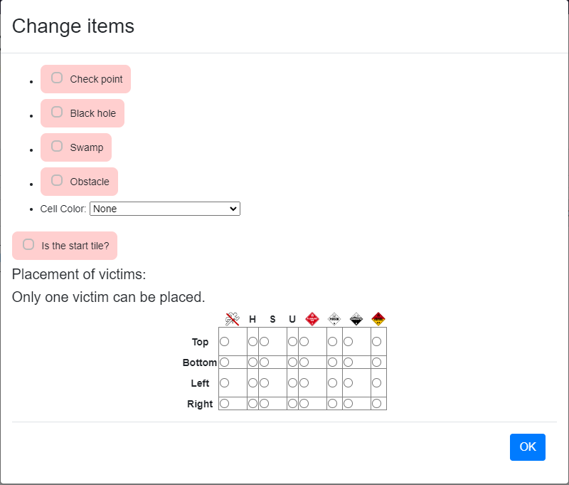
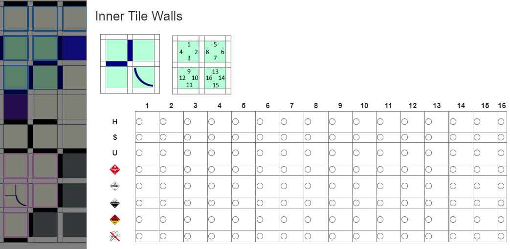

## Background

After you've conquered the test maps and your robot is able to run simple mazes, maybe you want something more challenging, or you want to test out some specific szenarios that our maps don't offer.  
For this you have access to the online [Map Creator Tool](https://osaka.rcj.cloud/service/editor/simulation/2021).

## Building the Maze
If you're just building small maps for testing, then the correctness of the field is probably not of much importance to you. But if you're planning on building an actual competition field, then you should definitely read through the official [Simulation Rules](https://junior.robocup.org/wp-content/uploads/2022Rules/2022_RescueSimulation_Rules_final02.pdf).

### Setting the size
The first step of creating your maze, is choosing the right size to start with.  
Just enter your desired width and length in the input field.
You can also resize your field later on, so just starting it bigger and downsizing it later can be smart.

### Placing walls
The next step is to setup your walls. We suggest that u start with the outer border and work your way through the middle, to create a maze. 
When placing the start tile, all floating tiles are marked with a green background and the tiles that are out of bounds are marked with a gray background.

### Marking the area
After you've created the basic maze, you have to choose which section of the maze is supposed to be area 2 and 3, for this you can just tick the box for the respective area and start highlighting each tile.  

### Placing half-walls and curved walls
For tiles of area 2 and 3 there a now some additional options for wall placement. To place a half-wall on the edge of a normal tile, click on an existing wall. It will cycle though all possible placements. To place quarter-tile walls and curved walls open the [Change items](#additional-options-for-area-2-and-3) window.

### Change item 

By clicking on a tile a pop-up will open:

You have the following Options:
| Setting| Desription |
|--------|------------|
Check point Black hole Swamp| Sets the tile property to the respective type. Only one of these options should be selected at a time.
Obstacle | Places an Obstacle. The shape and placement will be decided by random and can't be changed in the editor itself, but you can edit and move the obstacle in Webots, after loading the .wbt file.
Cell Color | Provides a drop-down to set the color for the connection tiles between areas. For information on how to position each connection correctly, please refer to the [Rules](#building-the-maze).
Is the start tile? | Sets the current tile as the starting tile. Replaces the previous start tile, if it has been defined before. After placing the start tile, all floating walls and out-of-bounds areas will be calculated.
Placement of victims| Provides a grid a to place the victims on the respective position. For area 1 only one victim per tile can be placed.

#### Additional options for Area 2 and 3

|||
|-|-|
Empty 2x2 grid| Provides the possibility to place half-walls and curved walls. Clicking on one of the 4 inner  walls will add or remove it. Clicking on the quarter-tiles will place/ rotate the curved walls. It also works as a preview for the selected victims.
victim matrix| Provides a matrix with which victims can be placed in all 16 possible positions. The small map above serves as a guide to where the victims are placed. To remove a victim from a position, you have to tick the box at the bottom (the crossed out stick figure). Be aware that multiple victims per tile can be placed

### Room 4
Currently, to insert a 4th room into their custom map, contestants must choose from a list of predefined room 4s to use. Below 
are steps on how to do so, or watch [this](https://youtu.be/BrPiRcHxqqM) YouTube video explanation with visual demonstration.
1. Go to your erebus folder that you downloaded. Navigate to erebus/game/protos, and look for the Area4_i.jpg files. Each file 
is a picture of one of the room 4s you can choose from. Pick which room 4 you would like to use and write down the following values:
    * The room 4 number (Area4_2.jpg -> room 4 #2)
    * The tile distance between the green and red entrance tiles. This is fixed.
2. Go to the world editor, find the "Select Room 4 Configuration Button," and select which room 4 you picked from step 1. The dropdown will tell you the size of that room 4.
3. Create the outer border of room 4 manually
4. Use the "Select Room 4 Tiles" button to select all tiles that belong to room 4.
5. Use the "Cell Color" function to place your green and red tile. Note that the distance between them must be the same 
as from step 1.
    * If desired, the selected room 4 has the ability to be rotated. If you place the red and green tile with the appropriate distance
between them, but rotate them 90, 180, or 270 degrees relative to your room 4 tiles, the imported room 4 will automatically be rotated appropriately.
6. After the world is exported, you may notice that the victims and hazards of room 4 are slightly off due to rounding error. You can
manually adjust this and then save your world.