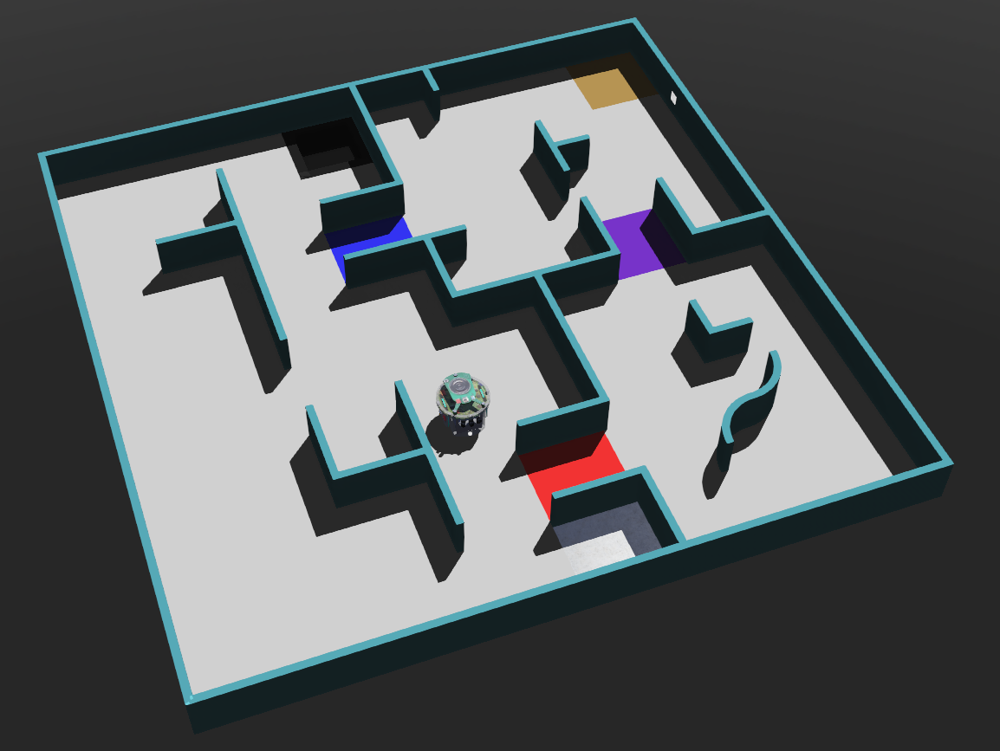

## Introducing Your Robot
In this challenge, the robot is a customizable Epuck. You can design your robot [here](https://robot.erebus.rcj.cloud/), adding the optimal sensors at the optimal positions. From there, you can export your robot as a JSON file, which you can then load into the robot window in Webots.



## Field
For the sample program, we will be working in a field similar to the one shown below. If you are unfamilar with how to find the various fields, visit the "Getting Started" section of the "Tutorials" section.

<figure>
  
 
  
  

</figure>

## Tasks/Activities
After working on this seminar, work through the following tasks (of increasing difficulty):

* Investigate different speeds/motions and sensor values - what is the most efficient values for navigating around the maze?
* Alter the program to track around in the side walls of the maze. To do this think about how you could use the distance sensors from one side of the robot to track along a wall. You will still need to use the front distance sensors, so think carefully about what order to put you if statements for the different sensors!
* To search quicker, could you vary the speed depending on how close you are to walls/objects? Look at using the sensor values to calculate the speed of the wheels.

Remember, for help/advice, or if you want to share ideas, head to [discord](https://discord.com/invite/6FJxZxk).

## Exemplar Code
Below we step through the example code developed step by step, explaining what is going on. Try and build this up by yourself first, referring back to this if you need. The full uninterrupted program can be found here: <a href="sample.cpp" download>C++</a> | <a href="sample.py" download>Python</a>

---

## Step-by-Step Introduction of the Code
First we initialise the robot and sensors. We import/include the necessary classes as we set the time step and also the maximum velocity of the robot. We also create a wheel_left and wheel_right object. (More details on the API can be found [here](https://cyberbotics.com/doc/reference/nodes-and-api-functions)). Lastly, we initialize an array to store the left and right motor speeds - we start by initalizing these to the max speed.




In the next step of the program, we initialize our distance sensors, camera, color sensor, emitter, and GPS. Remember that you can customize your own robot [here](https://robot.erebus.rcj.cloud/). Here is the layout for our sample robot:
1. Three distance sensors facing left, forward, and right
2. One forward facing camera for victim and hazard detection
3. One downward facing color sensor to detect black pits
4. One GPS for the robot's position when reporting victims and hazards
5. An emitter for reporting victims and hazards (not in diagram, on robot by default)

Here is the JSON file for the sample robot: <a href="SampleRobot.json" download>Sample Robot JSON</a>






Next, we set the 'position', we set this to be infinite, as this allows the wheels to turn infinitely, they are not limited by turning a certain amount.




We setup some functions which we can then call to set the movement of the robot. In each of these we set the speed of the left and right wheel using the speeds list. We also define a delay function for prolonged movements and a getColor function to retrieve the brightness level seen by the color sensor (grayscaled value from 0 (black) to 255 (white)).




We also create a several functions to help detect victims and hazards. The first function accepts a camera image and returns true if it detects a victim or hazard. It searches for contours (a contiguous shape within the image) whose area and width to height ratio fit within a certain range. Note that this function is by no means the optimal solution: it is prone to misdetections, can miss victims, and cannot differentiate between different letters and hazards - it is meant as an introduction into victim detection for you to improve upon.

After retrieving the image from the camera sensor, this function uses OpenCV to scan for victims. OpenCV for C++ can be difficult to install, and OpenCV in it of itself can be difficult to learn. Thus, if you feel a different method of victim detection will suffice, by all means comment out this function and implement your own solution. Do note, however, that the best solution essentially requires OpenCV or some other image processing library and that the internet has many useful resources for learning OpenCV.




To receieve points for a victim or hazard detection, you must report its location and type to the supervisor. The following function accepts a character for the victim/hazard type and reports it to the supervisor.




Here we have the main body of the program. First we setup a while loop that runs whilst the game is running (i.e. for the 8 minutes). It first checks for walls on the left, right, and front side, and turns away from any detected walls. It then uses the color sensor to check for a black pit, spinning away if detected. Lastly, it checks for a victim in view of the front camera and reports it anything it sees. Since the sample victim detection function is unable to differentiate between letters, it always reports 'T' for a thermal victim as a guess.




That about concludes the sample program. Again, you can find the interrupted full programs here: <a href="sample.cpp" download>C++</a> | <a href="sample.py" download>Python</a>. Note that this sample program is by no means an optimal solution, it is just meant to introduce you to working in the Webots environment in Rescue Maze. Good luck programming!