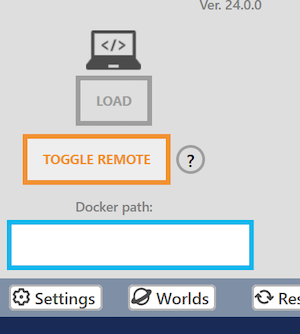
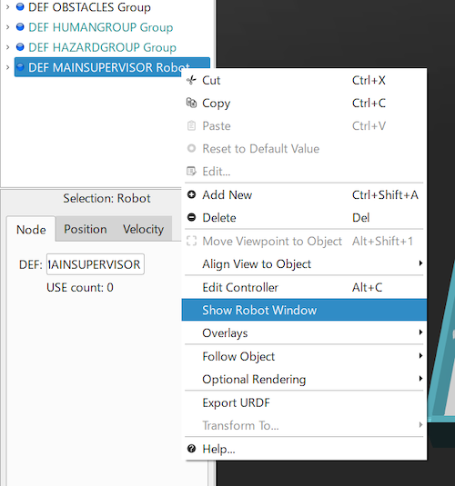
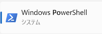
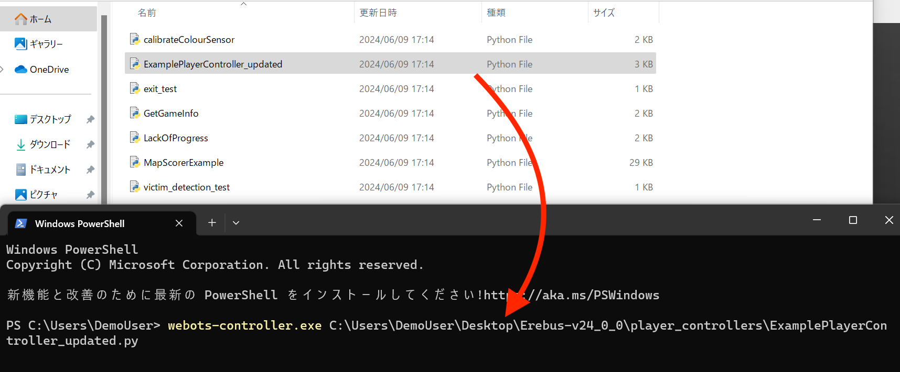
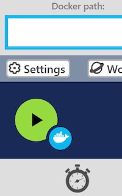
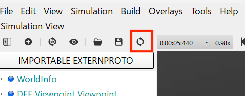

# Running the game server and controller programs on the same PC
First, let's try to run the game server and controller programs on the same PC. This is not the same as a real competition setup, but it will help you when you are debugging locally.

## Toggle Remote Mode
Press “Toggle Remote” on the Robot Window to enable the remote controller setup. The button color should turn orange to indicate that it is enabled.  

If the Robot Window is not displayed, right-click on the “MAINSUPERVISOR” and press “Show Robot Window”.  

## Execute Your Program
Open PowerShell. You can usually find it in the list of applications.  

Execute the following command within PowerShell. But replace `<Your controller path>` with the path to your controller program.

`webots-controller.exe <Your controller path>`

If you do not know the path to your controller program, you can drag and drop that file into the PowerShell window and it will automatically populate.  

After inputting the command, press enter to execute it.

## Start the Game
Press the Start button in the Robot Window to start the simulation.  

## Terminate the Game
To interrupt the execution of the game, interrupt the program running on PowerShell by pressing Ctrl+C.

Once the simulation is terminated, the Erebus game management system is terminated at the same time. If you want to run the game again, reload the world.  

# Running the game server on a different PC
This is a setup that may be used for official competitions.
The PC running your controller (Client) and the game server (Server) must be connected to the same network.

1. (Server) Start Webots on the server PC, open the world and turn on Remote Mode from the Robot Window. 
2. (Server) Find out the IP address of that PC. You can refer [this artcile for your reference](https://support.microsoft.com/en-gb/windows/find-your-ip-address-in-windows-f21a9bbc-c582-55cd-35e0-73431160a1b9).
3. (Client) Execute the following command within PowerShell. But replace `<Your controller path>` with the path to your controller program and `<Server IP address>` with the IP address which we figured out in previous step.   
`webots-controller.exe --protocol=tcp --ip-address=<Server IP address> <Your controller path>`
4. (Server) Start the game by puhsing start button.

# Official Document
If you want to know about the setup in more detail, you can find it in the [Official Guide](https://cyberbotics.com/doc/guide/running-extern-robot-controllers?version=R2023b).