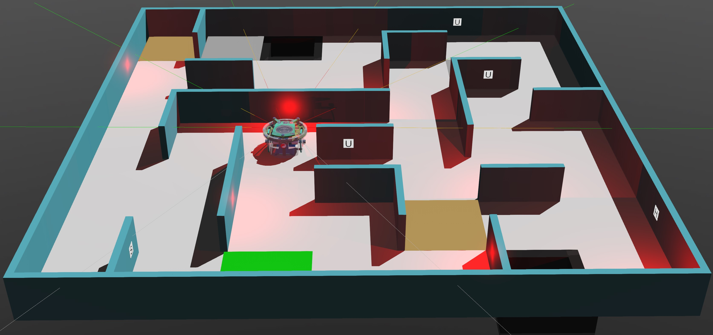

---
title: "Document"
linkTitle: "Document"
weight: 20
menu:
  main:
    weight: 20
---

# Erebus Rescue Maze Simulator
Erebus is a robot rescue simulation competition environment in which you must develop a controller for a robot to explore a maze and use sensing methods to find as many 'victims' whilst avoid obstacles and traps.

It is built on the [Webots](https://cyberbotics.com/), a robotic simulation platform designed for a professional use and has been widely used in industry, education and research. Cyberbotics maintains Webots as its main product continuously since 1998. Here is a link to [Webots official User Guide](https://cyberbotics.com/doc/guide/index). On this site we present documentation as well as tutorials and guides for using the Erebus simulator.
